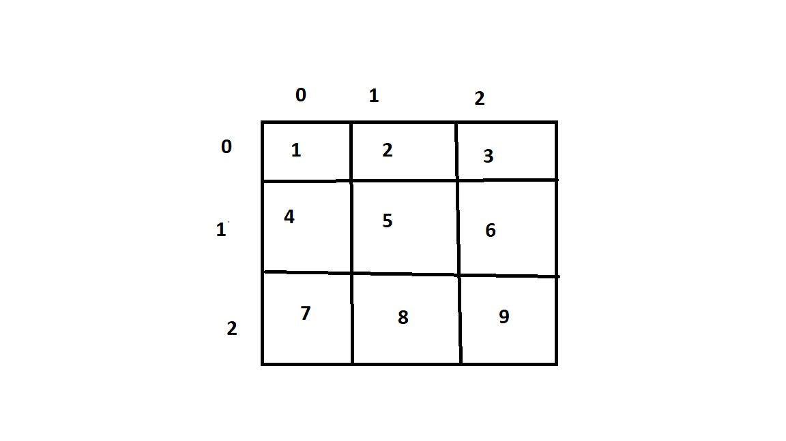

# VETORES

também chamados arrays (do inglês) ou arranjo ou ainda matrizes, são uma maneira de armazenar vários dados num mesmo nome de variável através do uso de índicesnuméricos. Em C, vetores devem sempre conter dados do mesmo tipo de variável.

```c
#include <stdio.h>

int main()
{
    int mat [3][3];

    mat[0][0] = 1;
    mat[0][1] = 2;
    mat[0][2] = 3;
    
    mat[1][0] = 4;
    mat[1][1] = 5;
    mat[1][2] = 6;
    
    mat[2][0] = 7;
    mat[2][1] = 8;
    mat[2][2] = 9;

    printf("Imprimindo a primeira linha\n");
    printf("%d %d %d",mat[0][0],mat[0][1],mat[0][2]);

}
```

Neste exemplo fica explicito o uso de vetores



para acessar os valores deve-se informar a coluna e linha, sabendo que o vetor foi informado com ```[3][3]```,sendo 3 colunas e 3 linhas.

E para acessar deve-se informar a coluna e linha, como informado abaixo, coluna 0 e linha 0:
```c
mat[0][0] = 1;
```
Na imagem acima qual numero esta na linha 0, coluna 0, sim o ```1```


### resultado:
```
Imprimindo a primeira linha
1 2 3
```


```c
#include <stdio.h>

int main()
{
    int mat[3][3] = {{1,2,3}, {4,5,6}, {7,8,9}};
    int i,j;

        printf("Imprimindo a primeira linha\n");

    for (j=0; j < 3; j++){
        printf("%d ", mat[0][j]);
    }
    
        printf("\n\nImprimindo a matriz toda:\n");
    for (i = 0; i < 3; i++){
        for (j=0; j < 3; j++){
            printf("%d ", mat[i][j]);
        }   
    }
}
```

1) Criamos uma matris com 3 linhas e 3 colunas, ```int mat[3][3]```, e ja inicializamos com os valores,```{{1,2,3}, {4,5,6}, {7,8,9}};```
```c
int mat[3][3] = {{1,2,3}, {4,5,6}, {7,8,9}};
```
2) Depois criamos duas variaveis, de tipo int,```int i,j;```

3) Depois abrimos o bloco de codigo for:
```c
for (j=0; j < 3; j++){
        printf("%d ", mat[0][j]);
    }
```
* Primeiro adicionamos o valor de j=0, criamos a condição enquanto j for menor que 3, execute e depois incremente +1 a j,```j < 3```
* Sendo assim a instrução a ser atendiada caso o for seja atendido e: ```printf("%d ", mat[0][j]);```, como o valor de j ira de 0 a 2, sendo 0,1,2, ele sera adicionada ao espaço da coluna das posições da primeira linha que e zero

### COLUNA:
```
    0       1       2

0   1       2       3    

1   4       5       6

2   7       8       9
```

* Na linha zero temos os elemento 1,2 e 3 que serão os valores adicionados a j:

Na primeira iteração j tera o valor 0, sendo linha 0, coluna 0 = 1
Na segunda iteração j tera o valor 1, sendo linha 0, coluna 1 = 2
Na terceira iteração j tera o valor 2, sendo linha 0, coluna 2 = 3

* E finaliza aqui

4) Segunda parte do codigo, assim como acima foi impresso todos elementos da coluna 0, vamos imprimir todos elementos.

5) Primeiro abrimos o primeiro bloco de codigo, que funciona da mesma forma que o anterior:
```c
for (i = 0; i < 3; i++){
        for (j=0; j < 3; j++){
            printf("%d ", mat[i][j]);
        }   
    }
```
```i``` reprsenta as linhas, como no exemplo anterior a linha selecionada foi 0, aqui serão todas.

```j``` representa as colunas, como no exemplo anterior.

Na primeira iteração i tera o valor 0, sendo linha 0, coluna 0 = 1
Na primeira iteração j tera o valor 0, sendo linha 0, coluna 0 = 1

E assim por diante, quando i mudar de valor j tambem mudara sendo i linhas e j colunas


### resultado:
```
Imprimindo a primeira linha
1 2 3

Imprimindo a matriz toda:
1 2 3 4 5 6 7 8 9
```