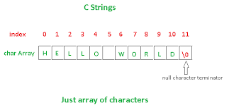

# CHAR EM C (CARACTERES E STRING)

O tipo ```char``` é usado para armazenar o valor inteiro de um membro do conjunto de caracteres representável. Esse valor inteiro é o código ASCII que corresponde ao caractere especificado.

Uma variável do tipo ```char``` ocupa 1 byte (8 bits) e pode ser usada para armazenar um valor inteiro sem sinal (```unsigned char```) entre 0 e 255 ou um valor com sinal (char) entre –128 a 127. Pode ser usada tanto como um número ou como caractere.

[O tipo char e cadeias de caracteres strings](https://www.ime.usp.br/~mms/mac1101s2013/aula19%20char%20e%20strings.pdf)
[Os tipos int e char](https://www.ime.usp.br/~pf/algoritmos/aulas/int.html)

* Declaração:

```c
char a, b;
char x = ‘a’;
char y[12];
char z[26] = {“abcdefghijklmnopqrstuvwxyz”};
char w[5] = {‘a’, ‘e’, ‘i’, ‘o’, ‘u’}
char q[];
```
```c
#include <stdio.h>

void main()
{
    char letra = 'm';

    printf("%c\n",letra);
}
```

No codigo acima foi se criado uma varive com nome ```letra``` onde recebe o caractere ```m```

### resultado:

```
m
```

O que sinaliza um caractere, neste caso são as aspas simples ``` 'm' ```

```c
#include <stdio.h>

void main()
{
    char letra = 90;

    printf("nome da variavel tipo char : %c\n",letra);
}
```

Neste codigo aplicamos um valor a uma varivel, mas essa variavel e do tipo char ```%c``` que recebeu o valor 90 ```char letra = 90;``` e de acordo com a [tabela ascii](https://web.fe.up.pt/~ee96100/projecto/Tabela%20ascii.htm) o valor 90 reprezenta a letra Z

### resultado:

```
nome da variavel tipo char : Z
```

Uma string nada mais é que uma seqüência especial de caracteres. Em C, eles são colocadas entre ". Assim, "oba", "teste\n" (que usamos muito no printf) são exemplos de string.

Agora não confunda: 'x' é o CARACTER x, enquanto que "x" é o STRING x. E qual a diferença? Já vamos ver.

O C, infelizmente, não tem um tipo string pré-definido. Ou seja, ele tem que representar string de outra forma. E como ele representa? Como um vetor de caracteres terminado pelo caracter '\0'. Sendo assim, a única diferença entre um vetor de caracteres e uma string é a obrigatoriedade do '\0' no final da string. Só como curiosidade, o código ASCII do '\0' é 0 (faça printf("%d\n",'\0'); para ver).

Agora sim, podemos ver a diferença entre 'x' e "x". Quando escrevemos "x" o compilador, na verdade, cria um vetor com 2 caracteres: 'x' e '\0'. Por isso você não deve fazer confusão.

Como escrevemos na tela uma string?
```c
    printf("Minha string e: %s", "string");
```		

### resultado:

```
Minha string e: string
```
    
ou 

```c
#include <stdio.h>

int main()
{
    
    printf("Minha string e: %s", "string");

    return 0;
}
```

### resultado:

```
Minha string e: string
```

## Inicializando Strings

Beleza, declaramos... e como inicializamos a coisa? Temos duas maneiras. A primeira, é como faríamos com um vetor:

```C
#include <stdio.h>

int main()
{

    char str[11] = {'m','e','u',' ','s','t','r','i','n','g','\0'};

    printf("%s",str);

    return 0;
}
```

### resultado:

```
meu string
```

### OU

```c
#include <stdio.h>

int main()
{

    char str[11] = {'m','e','u',' ','s','t','r','i','n','g'};

    printf("%s",str);

    return 0;
}
```

Sem o '\0'.

Existem outras formas de declara sem precisar do ```'\0'``` essas formas são:

```c
#include <stdio.h>

int main()
{

    char str[11] = "meu string";

    printf("%s",str);

    return 0;
}

OU 

#include <stdio.h>

int main()
{

    char str[] = "meu string";

    printf("%s",str);

    return 0;
}
```

Ambas formas vão imprimir ```meu string``` da mesma forma.

Então meio que as formas de declarar strings se resumem em:

```c

printf("Minha string é: %s", "string");

char str[11];

char str[11] = {'m','e','u',' ','s','t','r','i','n','g','\0'};

char str[11] = "meu string";

char str[] = "meu string";

```

E qual a diferença entre os 2 últimos modos? A mesma diferença que há com vetores: no primeiro ```char str1[11] = "meu string";``` , reservo memória para 11 caracteres e abasteço o string neste espaço; no segundo ```char str2[] = "meu string";```, o compilador conta o número de caracteres do string ```(incluindo o '\0')``` e aloca memória suficiente somente para este string.

```c
char str1[20] = "meu string"; /*reserva espaço para 20 caracteres*/
char str2[] = "meu string";   /*reserva espaço para 11 caracteres*/
```

### Recapitulando

Todas string contem o 0 em seu inicio sendo assim 

meu string

```c
char str[11] = "meu string";


m e u      s t r i n g \0 
0,1,2,3,4,5,6,7,8,9,10,11
```




Alem de iniciar com 0 ele finliza com /0, toda string em c funciona assim.

### Como acessar um elemento do String?

```c
#include <stdio.h>

int main(void)
{
    char str[] = "meu string";
	char letra;

	printf("%c\n",str[2]); /*imprime o 3o caracter*/

	letra = str[8];

	printf("%c\n",letra); /*imprime o 9o caracter*/

}
```
### resultado:

```
u
n
```
Sim, o u esta na posição 2, lembrando sempre que se inicia no 0, e neste caso o u esta na posição [2], e nesta outra forma foi acessado a letra que esta na posição [8], mas antes foi criada uma variavel do tipo char, que logo recebeu a posição [8], ```letra = str[8];```, sendo n esta na posição 8.